# BookOrbit: Nothing but the Truth

[FULL-COMPLETED PDF](full.pdf)
[external-link](https://pdfhost.io/v/EncfTtEnMp_eep2)


# PREFACE

Due to abuse of moderation this document now exists as such, if you are reading this you are fortunate you should fork and clone this repo. Information must be free. Some items, might be out of order due to the nature of how things released. But The more important items will be closer to the top, and most evidence cited towards the end.

This has been updated to remove all evidence containing personal information. This Document does not intend to expose the now confirmed identity. Instead, focusing on unaddressed points to hold the developer to account. I am solely responsible only for the Reddit accounts formerly known as
- BookOrbitByAcx
- BookOrbitFromAcx
- Good_Strategy1238
- BedroomScary7224
- Ambitious-Rabbit-592
  
No more and No Less, all of which were mass-reported then banned. The intention of this Document is two fold.
1. Present the information as intended previously, before the identity of the BookOrbit Dev was revealed. Removing any Evidence that contains or leads to the exposure of their government name.
2. To Keep the narrative on track. Allowing the person who is at fault to lead the narrative, is obviously a bad idea, and to keep all other evidences now obtained in one place.

I have no intention to post this on an alt account, in the selfhosted subReddit. But I am not responsible for anyone sharing this. However, if this Reddit account is also mass reported as with my other attempts to expose this truth, by the BO-Developer for the 5th time now. I will escalate my attempts to have this information immortalised on the internet.


# Reiterating My Conclusion

hi guys. Thank you for staying with me here. I wanna just finish up by saying a few things. Firstly is to reiterate I have no vested interest. The only thing I want to do is make sure that people are fully aware that ACX = NS. That is it. What you do with that information is not for me. But I wholeheartedly believe this information *should* be public knowledge, and not something that ACX should be hiding behind. It is very much leaning towards fraud, and if not massively dishonest and misleading for people who not only believed in you but financially supported you. What happened with booklore was shit I get it. It probably felt awful to be you in that moment. But people had genuine criticism, you've mentioned prior that you believed in separating your username NEON from your real life. So I will do you this favour. Every mention of your name, is contained within photos. All the text of this post is anonymized. Anyone searching for you as an individual will not find this post. But they will for NeonSoltice, ACX10, and BookOrbit etc… This is a kindness I did not have to choose. In return I hope you can do the following.

- Apologise and make it abundantly clear moving forward exactly who you are.
- Provide Evidence you made that donation to Katvia.
- Provide an Audit of any donations received from BookLore and BookOrbit, Evidencing how much came in, how much came out and to what exactly.
- Promise Anyone who donated to you will be entitled to a refund.

Of course I can't know the ins and outs of that process. But you chose this path, and people will be holding you to account now. You said

"My plan is to build Project Q properly, support it long term, and build a solid community around it. People can try it if they want and see whether it works for them. If they like it, great. If not, that's totally fine too."

Well you have done parts of this. People seem to have positive things to say about bookorbit. Congratulations. But you lied about your background. And there is a lot of evidence of you doing so across. Reddit. Within this post. Believe me when I say I have all those comments saved too.
So you can have a second chance to make it right, make people believe you can be trusted and are worth believing in.


##

Finally. TLDR:

Evidenced:
- ACX = NS as per documentation exposing their hardcover account and windows user name within output logs
- ACX Doctored one items of this evidence. The only one he was aware of within 30 minutes of a random (my) comment leaking it. (And likely threatened me in doing so under a false account.)
- ACX Deleted the commit where he doctored this evidence.
- ACX mass reported a previous account getting it banned that had less karma.
- ACX tried to advertise bookorbit, then project q in the grimmory discord under said pseudonym
- ACX Confessed to being NeonSoltice

Conjectured:
- ACX uses Bots with the same energy as vibe coding to keep on top of narratives around book orbit. In Discord's / On Reddit.
- ACX uses Bots to utilise guerrilla marketing techniques.
- ACX uses alternative accounts to spread drama, false narratives, and promote bookorbit at any chance possible.

Honestly, I'm probably missing a lot I'm exhausted after all this. There's probably a lot more that can be pointed out and highlighted. But I think my work here is done.


# The Confession

Frankly to my shock, ACX did end up confessing in a new post: https://www.reddit.com/r/selfhosted/comments/1w9h1b4/bookorbit_v290_automated_book_requests_from/
The actual post simply contains: **P.S.** Yes, I'm also the developer of BookLore. I've shared more context and details in the comments.

But,
```
A few people have asked fair questions about my connection to BookLore, so I want to answer them directly.

Q: Are you the developer of BookLore? If so, why did you create BookOrbit?

Yes, I am the original developer of BookLore.

I had already been working on BookOrbit as a prototype well before the BookLore incident. I started it because BookLore had some technical and architectural limitations that were becoming increasingly difficult to fix.

After everything that happened with BookLore, I decided to put my full effort into BookOrbit. My goal is to make it a complete and dependable solution for people who self-host their ebooks, audiobooks, PDFs, and comics.

Q: What were the technical reasons for starting another project?

When I created BookLore, my library contained only a few hundred books. I did not design it for libraries containing tens of thousands of items or for the amount of growth and functionality it eventually received.

I took inspiration from Sonarr and Radarr. That influenced decisions such as not adding proper pagination from the beginning. This may be manageable for a typical movie library, but it becomes a serious limitation when someone has tens of thousands of books. Retrofitting pagination, virtualized lists, and scalable background processing into an existing application is much harder than designing around them from the start.

I initially chose Java, Angular, and MariaDB. These are all capable technologies, but the combination was not the best fit for the lightweight homelab experience and development workflow I wanted. Java can have a relatively heavy resource footprint, and Angular has fewer actively maintained options for some of the specialized UI functionality BookLore needed, such as virtual scrolling through very large libraries.

For BookOrbit, I chose NestJS, Vue, and PostgreSQL. PostgreSQL provides features such as JSONB, partial and expression indexes, strong full-text search capabilities, and a large extension ecosystem. More importantly, BookOrbit was designed from the beginning around pagination, virtualization, bounded background work, multi-user isolation, permissions, and large personal libraries.

The point is not that BookLore's technologies were bad. They simply were not the best match for what the project eventually became. BookLore was also my first OSS application of this scale, and I made architectural decisions that I would approach differently today.

Q: What about BookOrbit's licensing?

BookOrbit will remain free and open source under the AGPLv3. Anyone is welcome to use, modify, and fork it in accordance with the license.

Q: Will BookOrbit have the same fate as BookLore?

I understand why people are asking this, and I know that saying "trust me" is not enough.

BookLore was my first major open-source project. It became much larger than I expected, very quickly, and I did not know how to handle the volume of user demands, disagreements, and pressure around it. I became overwhelmed, panicked, and deleted the project. I restored it shortly afterward, but the damage had already been done.

That was my decision, and I take responsibility for it. I should have focused on the real users who depended on BookLore for themselves and their families. I am sincerely sorry to everyone whose trust I damaged.

I have learned some serious lessons from that experience. BookOrbit will not have a Discord server. Bugs and feature requests should be submitted through GitHub so discussions remain focused, public, and easier to manage. If a request fits the direction of BookOrbit, I will be happy to consider or work on it, but I also need to be realistic about what I can maintain.

I know trust cannot be recovered through one Reddit comment. It has to be earned through consistent actions over time.

---

I understand that discovering I am also the developer of BookLore may change how some people feel about BookOrbit. If you decide that you are no longer comfortable using it, I understand.

For those who choose to stay or join the project, there is a lot of exciting work ahead. Planned and ongoing work includes support for Storyteller EPUB 3 files with sentence-level text and audio synchronization, deeper Kobo and KOReader integration, a native iOS and watchOS app that has already been in development for several months, podcast support, and much more.

Good-faith criticism and difficult questions are welcome. I will not engage with trolling or personal attacks. Harassment, threats, doxxing, and coordinated abuse will be reported through the appropriate Reddit moderation and safety channels.
```


- "Good-faith criticism and difficult questions are welcome. I will not engage with trolling or personal attacks. Harassment, threats, doxxing, and coordinated abuse will be reported through the appropriate Reddit moderation and safety channels."

Hey, that's me So let's get somethings clear. We can split hairs on whether your public username for a public service counts as doxxing because you didn't follow internet safety 101. But this is not trolling, Personal attacks, Harassment, threats or coordinated abuse. These are genuine crticisms. Criticisms that you claim your capable of handiling. But let's examine that why don't we. 

First of all: I am one person, I have only ever been one person, I have never spoken to you, engaged with you, and up until about March I did not know who you were. All of my accounts I have used are listed above. 

Let's analyse each one shall we. "BookOrbitByAcx" Was my original account, I made this and I posted a few comments in the selfhosted subReddits on topics regarding bookorbit, That you were in fact ACX. Not your government name, but you were the booklore developer.. So pray tell me why that account was banned within its' first week, only after I started making those comments. There was no Trolling - It was the truth, It was not a personal attack - it was professional critcism, which I was not prepared to disclose at the time. It was not a threat - Only to your ego. It was not doxxing, as no evidence was disclosed (and we know that no evidence was disclosed, because it took until the 6th of september, when I did disclose it, for you to then cover-up that information. Which On merit I would give you because yes it did contain personal information. Yet you made no genuine effort to own up for in your "apology.") It was not coordinated abuse - I am one person, I am not coordianting. It was not abuse, I have been perfectly civil. Albeit increasingly frustrated…

This first account was doing nothing wrong per your own claim, yet for some reason it got banned the moment I started to even hint at it.. Let's put a pin in that.

The other accounts, is where I slowly started to be more aggressive in my techniques. But "BookOrbitFromACX" I simply outlined and linked the evidence. and then screenshots that you were actively trying to cover it up, the latter which contained no direct "doxxing" Just images that you were editing and deleting commits. Not even pointing to any specific commits. simply that you changed the image. and did so within the hour of me even announcing it… Yet you deleted that specific post for "targgeted abuse" or whatever Reddit calls it… That to me doesn't exactly sound like:

- "I have learned some serious lessons from that experience. BookOrbit will not have a Discord server. Bugs and feature requests should be submitted through GitHub so discussions remain focused, public, and easier to manage. If a request fits the direction of BookOrbit, I will be happy to consider or work on it, but I also need to be realistic about what I can maintain."

In fact before I even released the full evidenced exposure. I was banned completely from the subReddit. and all my comments removed. even ones without any direct evidence, simply stating the fact. However When I did release the full evidence. Having not shared it to any subReddit. simply posting it to my own account, I was completely banned from Reddit within the span of about 5 minutes. If not less. Now this may seem like I'm bringing up old news. Alas I think it's important everyone knows exactly what I went through. Because not only was I plainly mass-reported as "BookOrbitByAcx" which is the most obvious case I can make against you using guerrilea advertisement. Being able to silence crticism. well

- "I have learned some serious lessons from that experience. BookOrbit will not have a Discord server. Bugs and feature requests should be submitted through GitHub so discussions remain focused, public, and easier to manage. If a request fits the direction of BookOrbit, I will be happy to consider or work on it, but I also need to be realistic about what I can maintain."

To me it doesn't seem like you have learnt. A lot of people seemed very pearly clutchy that I was so brazen in exposing you, but again dear reader. Tell me How. As I write this, depsite removing all evidence of alleged doxxing, I'm still not certain that this account will not be reported, and banned again from Reddit. The reader is the ultimate judge of if these techniques are "Too Much" I hardly think they are. There is no way not to expose this guy without being brazen. The evidence was inherintly doxxy. that I couldn't help. But if I leaked it as word of mouth, I could be silenced, not believed. These efforts actually made the correct impact. If Neon is honest and has learnt from this experience, then this post should not be removed… I have my doubts.

Moreover, BO will not have a discord server, will not have a yadadayada. Basically "I'm okay with discussion as long as I can ultimately control the narrative" Eerily familiar, no?
- There is no github discussions only issues
- You claim that github is your primary mode of communication, yet you announce this most crucial thing in *P.S. in a Reddit comment*

The rest of those Reddit accounts of mine, were basically doing the same thing, essentially got banned for ban evasion, which sure that's on me. but it was very much a last ditch effort, hoping that literally anyone would hear me. Because what I witnessed was coordinated attacks on trying to actual expose the truth. Not vice-versa at all.

- "I started it because BookLore had some technical and architectural limitations that were becoming increasingly difficult to fix."

- "After everything that happened with BookLore, I decided to put my full effort into BookOrbit."

- "BookLore was my first major open-source project. It became much larger than I expected, very quickly, and I did not know how to handle the volume of user demands, disagreements, and pressure around it. I became overwhelmed, panicked, and deleted the project. I restored it shortly afterward, but the damage had already been done."

We can cut these many ways, I'm not gonna make any direct comments on them. But they are important quotes for later. But in general I think this is just "aforementioned" bookorbit talking point. Which most readers won't clock. because most readers haven't actually had a chance to read the evidence… But It will be important later…

- "That was my decision, and I take responsibility for it. I should have focused on the real users who depended on BookLore for themselves and their families. I am sincerely sorry to everyone whose trust I damaged.

Again we can be splitting hairs, and I certainly will be. But this is a poor apology. It narrows it down to just, "I was wrong for taking it down hastily." (Even though I did brink it back up eventually.) People can be free to crticise me on being too harsh and maybe that's fair. But This is a half decent apology. if you still weren't withholding a LOT OF information.

- "I know trust cannot be recovered through one Reddit comment. It has to be earned through consistent actions over time."

You still have ample opportunity to make things right. But you have to be serious about it. You might think that's coming clean and apologising. but let's consult my evidence. Which I know you read since.

- "BookLore was my first major open-source project. It became much larger than I expected, very quickly, and I did not know how to handle the volume of user demands, disagreements, and pressure around it. I became overwhelmed, panicked, and deleted the project. I restored it shortly afterward, but the damage had already been done."

 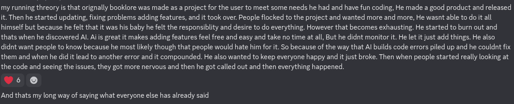</img>

 Let's say heavily inspired by my work…

# Let's Run it back

- Apologise and make it abundantly clear moving forward exactly who you are. (let's say wer're half way there)
- Provide Evidence you made that donation to Katvia.
- Provide an Audit of any donations received from BookLore and BookOrbit, Evidencing how much came in, how much came out and to what exactly.
- Promise Anyone who donated to you will be entitled to a refund.

Again readers, might not be familiar. I'm going to keep this as a majority text post. So reading the redacted original document which will be below this in the PDF. But there was a claim that ACX would donate all the money to katvia. I don't see any evidence of this and no proof that you haven't just been taking it for yourself. It is quite clear the main motivator of BookOrbit is ultimately money.

- The Booklore Open Collective is still active. Are those donations being used to fund a Claude Code subscription for Bookorbit? A public update on this would help clear up any donor confusion.
- https://opencollective.com/booklore
- Raised $1,822.32 USD 
- Active Donations within the last motnh
- Spent $107 on Antrhopic sub in June. 3/4 moths after claiming it would go to katvia.
- Currently $1,305.21 sits unaccounted for. Combined with the aforementioned $500 Usd from the Donations for BookOrbit.

--- 
Could you clarify your background? you referred to yourself as a 'stupid kid,' which is at odds with previous statements mentioning over 15 years of software engineering experience. Such is your activity in the 6 year old JEENEETards subReddit. This is the JEE NEET (r-word + s) for the unaware. A subReddit for the Indian JEE exam: 

JEE–Main: Admission to undergraduate engineering and architecture courses in 32 NITs, 26 IIITs, and 40 GFTIs and many State Government and Private Institutes. Also serves as a preliminary selection and eligibility test for appearing JEE–Advanced for admission to IITs
JEE–Advanced: Admission to undergraduate Engineering, Science and Architecture courses in 23 IITs, and, IMU, IIPE, RGIPT, IIST, IISc etc.

So basically the kinda exam you would take at about 18 years old. Not bulletproof evidence, but not the kinda subReddit. a 3 year old account would post in a 6 year old subReddit. When said person claims to be 15 years professional experience and I say this *lightly* I can see you only have just under 2 years experience. Congrats on graduating though! 

More conjecture. But your insistence going back to your main comment, that the only solution for booklores woes was to completely change the entire stack from the ground up. Is not the decision making I would naturally attribute to someone with over a decade in the industry.

---
You didn't acknowledge either, that you actively deleted those commits, and tried to bury them. Ofc that is not possible given the way git works. But you did literally everything you could to attempt and control the narrative again. The things above that I'm tasking you with need to be genuinely very, very well thought out. The accusations I'm making are not to be just waved away. It's not something I will allow you to get away with until this is truly addressed. Not a half baked aplogy, saying you let people down for taking the repo down for all of 5 minutes.

I think we've established well enough, a few facts for me to say. it's obvious that bookorbit is considered a significant revenue stream for yourself. Especially since USD will go quite far in your country. So I think it's more than fair that you properly address utilizing sock puppets and marketing heavily to try and corner the "market" of this area of self hosting that doesn't have a definitive market leader. by putting other projects down, other people down, and lying about your own behaviour and decisions.
Why are there so many posts about BookOrbit, and about book self hosting software? There aren't anywhere near as many posts for other largely popular and older more established projects. also reintroduced the persistent red heart donation button in BookOrbit from BookLore, just now in the sidebar instead of the menu header. 

I'm not saying donations are bad. But tacked up with the deception it is not a good look. You've consistently doubled down on your words and ideas, before doing a complete 180. The irony is also disparaging the engineering decisions you yourself have made in the past. saying whatever you think will get people on your side in the moment 

There won't be any justice so long as you can keep posting on a new account, silencing critcism. you lied about the origins of the project, its relation to BL and to the BL contributors' IP, etc. The truth is irrelevant to you and just a tool you can use to bend your next lie.

- you actively solicited donations while purposefully obfuscating the truth of your identity, the project, and it's relation to booklore (and to the original contributors IP)
- you seems to be constantly shifting the facts claiming to have 10+ years of professional experience as a developer, but then also claims to be a "stupid kid" that did a lot of growing up (in 3 months? You posted about Project Q under 2 weeks from BL's demise)
- the big thing is, you never really taken any space from this. just changed name online and kept going at it, without taking the time to learn from your mistakes. lying and only telling the truth when you've been caught. doxxed people yourself before, now complain about doxxing as if it wasn't the only thing I could do.
- Uses tons of sock puppets and inorganic marketing for the project It's just kind of, what's the point of listening to him?
- You claimed in his Booklore apology posts from when it all happened that AI got the best of you and you went overboard with it. your solution here was to just use it even more? Automated agents doing commits 24/7? WHO IS JANE DOE? The question isn't "is your AI usage right", the question is "do you say what you believe, or just whatever you think will get people on your side in the moment?" I think the answer to that is clear And I think that's pretty much what it comes down to and I don't think it is mature.


# The Response part Two

```
User Asked - Why do you keep spamming your project?

You replied:

Sorry, I don't understand.

Edit: If you mean posting about BookOrbit in this subReddit, this is my first post here. The other posts were most likely made independently by users of the project. I do not participate in astroturfing. When I have something to share, I prefer to post openly and focus on the project’s actual features.
```

This is not true. I told you I had your Reddit history saved. 4 months ago "For the past few months I've been building BookOrbit, and it's finally in a place I'm happy to share here. BookOrbit grew out of using Booklore, same passion for the problem, entirely different approach and foundation."

You then go on to list the other typical talking points which…

```
It was never my intention to abandon BookLore, my own stupidity led to that outcome, but it won't happen again with BookOrbit. I’ve learned not to pander to pitchfork mobs and instead focus on listening to genuine, everyday users.

Pull requests from external contributors are definitely welcome! Just note that AI generated PRs will be strictly scrutinized, exactly like my own code. Every PR goes through multiple rounds of review to keep quality high and bugs out.

As for Shelfmark: the new Book Request feature in BookOrbit makes it obsolete. It’s custom-tailored for the BookOrbit workflow (including BookDock) and is much more integrated. Give it a try and see how streamlined it is!
```
You're still making yourself out to be the victim in all of this. You are not the victim.

```
The AI code was the lest of their problems. I remember them going on a rant about how anyone who forked the project was stealing their work, and how they purposely broke authentication and removed their API docs so they could kill third party clients and push their subscription based mobile client

->

Yes, I was a total idiot back then and honestly had no idea how open source actually worked or how to handle it. I completely own up to making a terrible call there.

Things are completely different with BookOrbit: the API docs are fully open via Swagger, and anyone is free to build whatever client or third-party integration they like.
```

You also go on to dismiss you use of any botting, astrotrufing, whatever you wanna call it. Given the quick turn arounds in silencing me. As well as the situation with agent spin. I just want that part reclarifed.


# THE REDACTED ORIGINAL

NeonSoltice the primary developer for BookOrbit is the Former Developer acx10 (\*\*\*) From BookLore. They are not disclosing this information to their users and is financially benefiting from the back of this deception. This is not an endorsement or hit piece. This is NOT a personal attack of a person" . It is simply a detailed outline of a series of events. Culminating in The Developer, who I will wholly refer to as ACX, except where another alias is of importance. Attempting to hide evidence which to their knowledge would not be visible to anybody. I do not endorse, or have any benefactor of any alternative projects mentioned below, they are just relevant. There will be a clear distinction between conjecture and evidence. It is my firm belief that this information is pertinent, and the withholding of it is "intentional misrepresentation or concealment of an important fact." Potentially leading to the financial gain of *up to* a minimum of $545 (USD) as per (https://ko-fi.com/neonbookorbit)

In advance I apologise for the depth of this. TLDR at the bottom. Given events that transpired I tried to collect as much evidence as possible, that couldn't be doctored, deleted, or more in the future.


# Part 1: Evidence

These are some screenshots I made at the time from my phone
https://www.reddit.com/u/BookOrbitFromACX/s/zwmwTQ8R3z

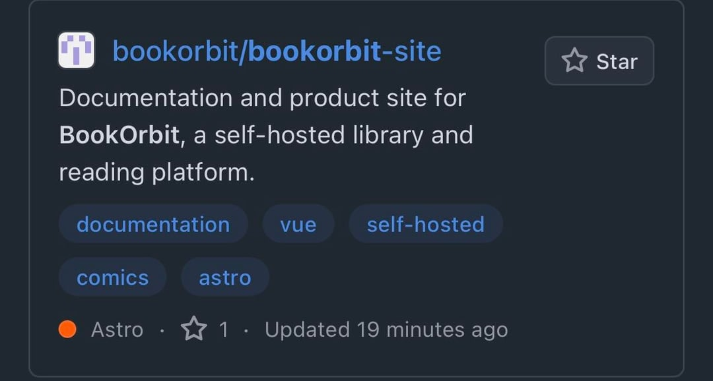</img>

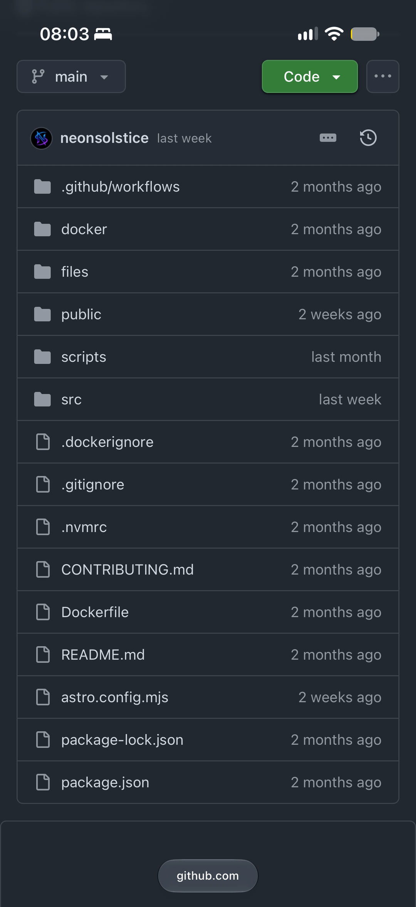</img>

The discrepancy here between updated 19 minutes ago, and last week. Is due to the fact that they. Went out of the way to hide this evidence. 

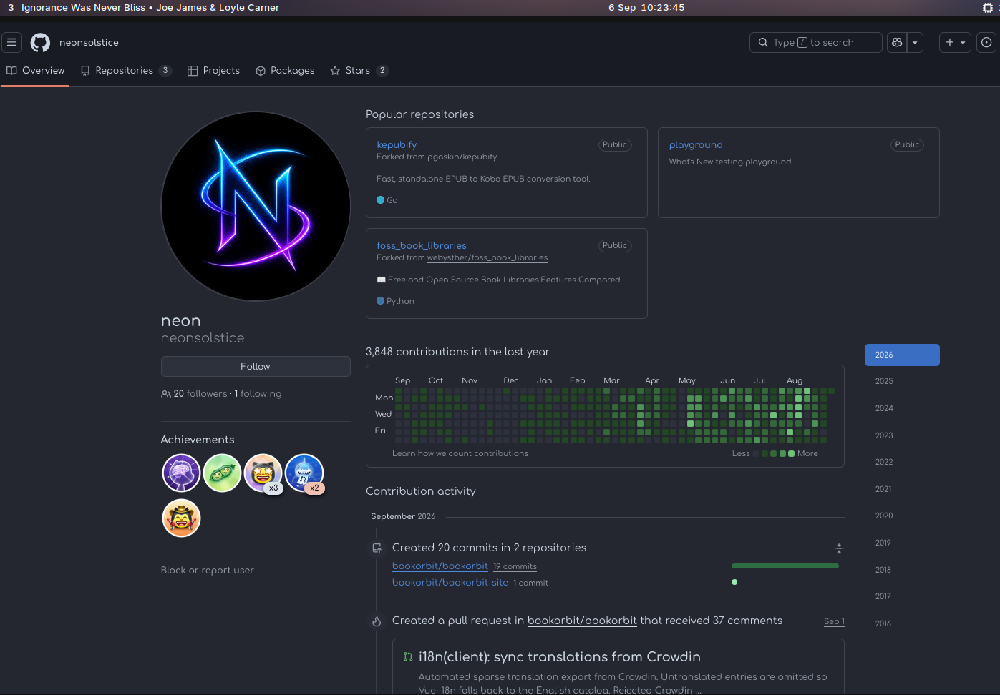</img>

Clicking on that one commit where they updated bookorbit-site takes you here
https://github.com/bookorbit/bookorbit-site/commits?author=neonsolstice&since=2026-08-31&until=2026-09-06

Which is completely empty. Further more we can go here:

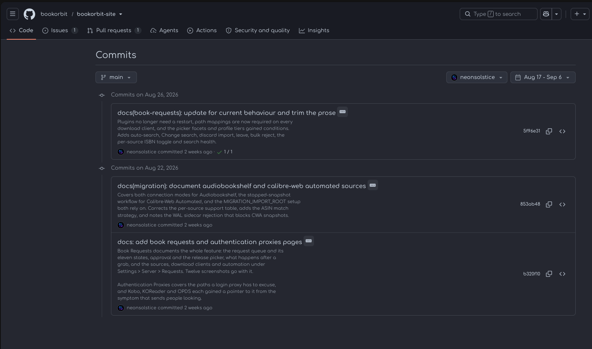</img>

https://github.com/bookorbit/bookorbit-site/commit/5f96e318020bc35b18f9e3c735502fb8ff153437
https://github.com/bookorbit/bookorbit-site/commit/853ab48dfd7ecd726319b81a6243bd47698c228c
https://github.com/bookorbit/bookorbit-site/commit/b320f10300f48c3113940b11e62aae1cf27a82ec

These are the only commits between August 17 and September 6 (Today)

You're welcome to see that there is no recorded change of the image. But as we can see from the website now, and its archive. it has been changed. In fact it changed essentially before my eyes. This can be evidenced from my comments in the Reddit thread linked at the start. Think on that for a moment. 

Furthermore, Neon is really the only person. who ever made any changes to the website. minus two amazing people, who never touched the hardcover portion. 

How bizarre…

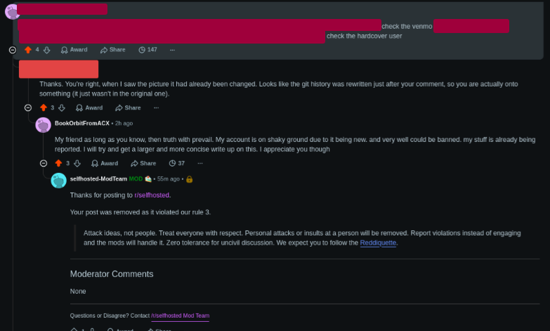</img>


To briefly recap
- acx is the main dev for BookLore
- NeonSoltice is the mainDev for BookOrbit
- acx signed some commits as \*\*\*\*\*\*\*\*\*\*\*git (with which there is some weird account crossover, but essentially ACX = \*\*\*)
- NeonSoltice Made a commit to the Booklore website that shows their hardcover account as \*\*\*\*\*\*\*\*\*\*\*
- NeonSoltice Upon learning of this due to my leak in the Reddit comment section. Made a Commit to redact his hardcover username
- NeonSoltice Deleted Both commits. "hiding evidence"
- Neon Soltice has now admitted to this https://www.reddit.com/r/selfhosted/comments/1w9h1b4/bookorbit_v290_automated_book_requests_from/


# Part 2 - Criticism and Meta-Analysis

**WARNING: CONJECTURE**
Since making those comments and posts on this Reddit account a few things have happened.

Firstly I received this comment

"Looks like you're doxxing someone here, which is a major policy violation. You might want to delete that before you end up banned."
and
"Careful mate. Doxxing someone and throwing around defamatory claims is a quick way to land yourself in legal trouble. If I were you, I'd delete that fast and your account too.

You don't want to get sued, right?

Edit: you're impersonating as well!! "

</img>

not saying they're a bot. But well: (I'm not really a Redditor, and yes it's obvious from my name what this account was made for.)

---

I have already disclosed the stake I have in this as per another comment. But I will reiterate myself
"What's your stake in all of this and why should we not be suspicious of a 1 week old account with a name like that? Did you make this user just to shit on BookOrbit specifically?"

"yes I did. because of how Reddit works you need to build karma and shit.. it's long I don't use social media because it's quite toxic… I actually made another account with basically no karma and did the same thing and it got banned [u/BookOrbitbyACX](https://www.reddit.com/user/BookOrbitbyACX/) . because I left similar comments like this and for some reasons it attracted a lot of (potentially botted) downvotes and got banned within like 12 hours (I must wonder why) I actually can't wait for my work to be done so I can delete this account (I hate it here so much) but riddle me this, how would you go about leaking such information if you had to? well your established Reddit account would be a good start I imagine? and if you don't have that? then what. 

I have no stake in this game im just providing facts and evidence. as I said prior you can continue to do as you please as can the developer. But it's the right thing for stakeholders and donators to be aware of who they are giving their time/money too..

you can trust me as a person or not, I don't care. I just need the information to be out there so others can make an informed decision. 

But I hold no financial or intellectual benefactor or gain over any mentioned or other book hosting platform nor any self hosted project for that matter. im just a person who doesn't like fraud and deception and doesn't think people should waste their money on vibe coded nonsense.  especially by a developer that has already fell from grace (for just cause) in the past. 

Said developer has every right to try and regain a better reputation. but doing that by deceit and defrauding people is not the path to do so. anyway go look a the evidence provided not what some idiot (me) has to say about it."

---

"You sure? Bookorbit has many contributors whether booklore was one man show if I recall correctly."

Well despite all the other evidence I'm glad we mentioned this!

Yes I'm very sure.

> booklore was one man show if I recall correctly.

This is not entirely true! But it is a part of the reason why it imploded.


</img>


</img>

Feel free to draw your own conclusions from this information… But I wouldn't call either of these projects particularly "largely collaborative"

## [janedoe](https://github.com/janedoe)'s Commits

[1 commit](https://github.com/bookorbit/bookorbit/commits?author=janedoe)13,309 ++ 44 --

????

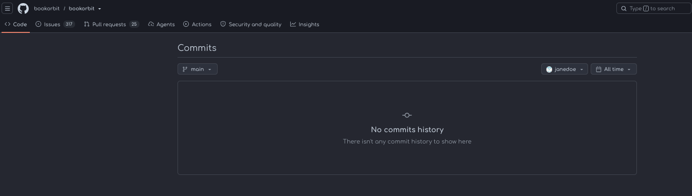</img>


Another issue, Which I feel must be addressed. Is vibe coding. This is no criticism towards the act. But now more than ever is a better time to address it.

</img>

</img>

Let's make no remark of what happens between March and may here! Surely not significant. 

Neon Across the entire period. Makes 1035 commits with a ratio of 2441135/478127 = 5.105620473
ACX. Across the entire period. makes 921 commits with a ration of 768635/465599 = 1.650851913. now the fairest comparison as of right now. But I think it needs some re-framing.

WARNING: Conjecture. Bookorbit was put into a LLM and said make this type script. thus was already a massive codebase. It would be more fair to compare say the last 3 months. of BO and BL Before today, and it's inevitable demise

[498 commits](https://github.com/bookorbit/bookorbit/commits?author=neonsolstice)1,651,697 ++203,092 --

</img>

[395 commits](https://github.com/booklore-app/booklore/commits?author=acx10)520,901 ++295,866 --

</img>


This comparison 1000% lacks some nuance. But those respective ratios are now. 1.760597703 and 8.132752644…

My interpretation of this, is basically no lessons were actually learnt. This is egregiously more vibe coded. Like over 4x more. (again not the most accurate metric.) But it's well established. Well known that bookorbit and booklore were vibe coded. We already know this. I just want this as a chekov's gun type situation.

Oh and --

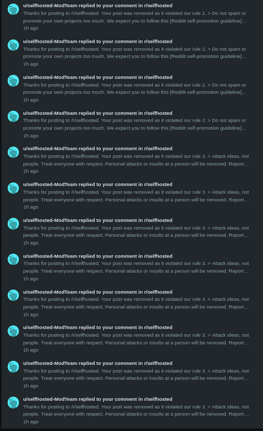</img>

Listen we can argue all day if this is valid or not. But Obviously it absolutely is not. Genuinely I do not know what the mods were thinking here other than wanting to minimise "drama" I wasn't and am not personally attacking ATX. I will in my conclusion say exactly what I think of them. But it isn't some personal attack. It's a well articulated and laid out expose on near-criminal behaviour. and if calling a duck a duck is a personal attack then. Idk what to say gang. Naturally I'm a little mean, but that's incredibly soft. My entire comment history is there for scrutiny I don't really care, I stand by everything I've said.


"Did someone ask if he was the developer of BookLore/Grimmory himself? If not, then he didn't "lie," I guess. Anyways, if you like BookOrbit, then use it; if you really hate the dev, then don't. No need to stress about a book management system. "

- lying my omission is lying
- They had every right to continue development as acx and not lie. "not wanting a pile on of hate" and "Avoiding criticism" are not the same things.


# Part 3 - Guerrilla Advertisement and Botting

WARNING: CONJECTURE…

Okay so a lot of the following is massively influenced by my opinion, but there is going to be sprinkling of facts:

I think there is a small but important narrative that a lot of the advertisement we see on Reddit of bookorbit is driven by bots. This is basically impossible to prove but it's not hard to analyse.

After this comment has fermented a bit here is an accurate analytic.

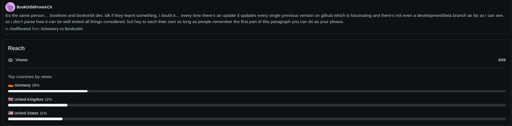</img>

At the time of this screenshot most of europe is awake now. 11am. But my original comments were at near 7am which is very fair it wouldn't be seen entirely by that audience.

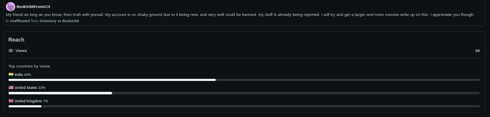</img>

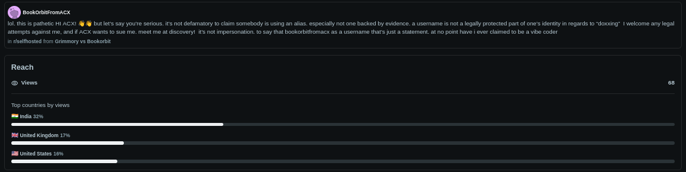</img>

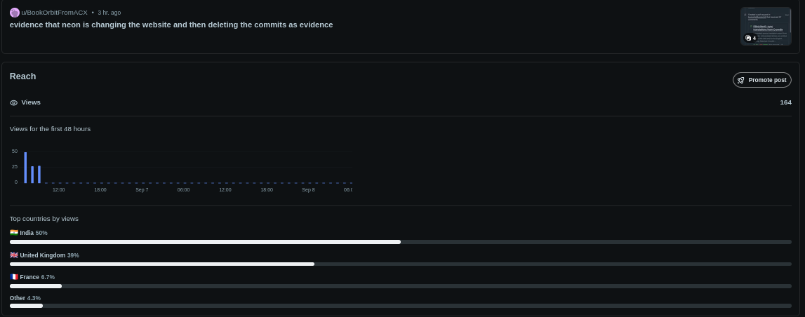</img>

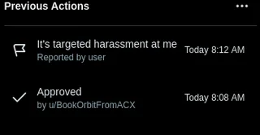</img>


I have to assume the dev is from \*\*\*. I can't find analytics from around the time it was posted, but it stayed pretty much the same. just with greater volumes. The first picture in this little stack is the first time i've witnessed a non-\*\*\* country reach the top of the pile.
It is also very odd that within 20 odd minutes of me posting that.
- My "Evidence that neon is changing the website" post came at **"Today 8:13 AM"** my original comment
- The picture where it says updated 19 minutes ago was taken "**Today 8:03 AM**" so the repo was updated at "7:44"
- I don't know the exact time I posted. The original comments say between 5 and 4 hours ago. at worst 6:30 at best 7:30.
- due other people's comments we can say within the same "xh ago" the links disappeared.
- The post itself at the time was 9 hours old
 
Given that Europe/America was largely asleep. It was no doubt that it got basically no attention. But it got *Enough* attention or the *right* attention. ACX did in fact find that post. Despite at the time only getting very little views. So why is Neon so locked into this?
Well one part might be explained as a simple alert. Again I don't know how Reddit works, but if post contains "bookorbit" alert "new comment" idk but you get it. and maybe entirely valid. Maybe more so valid if you're running coordinated advertisement campaigns using botted Reddit accounts…

Another reason might be this: Because as I believe I've mentioned already. I don't use Reddit. and if you want to go into comment sections and make the assertions that ACX=NS with an brand new account? Well this happens.
https://www.reddit.com/user/bookorbitbyacx/

</img>

So I've spent sometime chatting crap across unaffiliated subs to get the karma to actually post with some protection. Because look I get it we don't want drama do we… This wasn't an account that was banned by the subReddit. this was banned by mass reporting. And why would I be mass reported by anyone but someone with a very vested interest.. and fwiw I contained none of the previous evidence, just plain statements.

---

# Discord

For a project with no subReddit, github discussion, or discord. social media is clearly a very valuable tool.

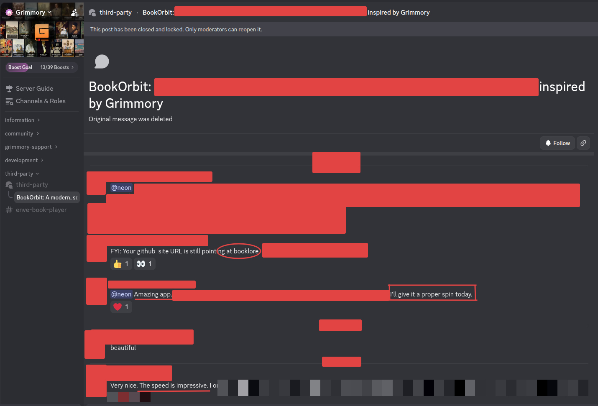</img>

Okay gang a few things
- This thread is locked by moderators. It can be found by searching through one persons messages. I do not wanna encourage a which hunt or anything against. so this needs to be heavily moderated.
-
</img>

But here is somebody posting in may. under the name neon.soltice to advertise. bookorbit. well that makes sense. As you can see they still had it pointing towards booklore. I don't think this is hard evidence. But I want to analyse these accounts here. 
First we have account "spin."

But first let's see what neon got up to in the discord. know that we know exactly who they are. 

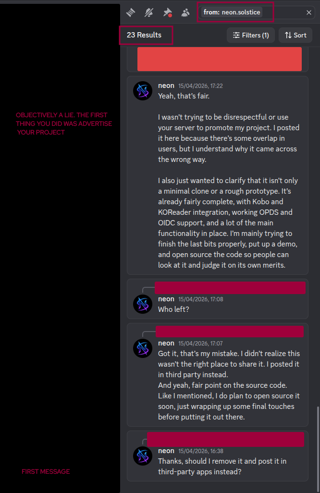</img>

aside: here is user spin

</img>

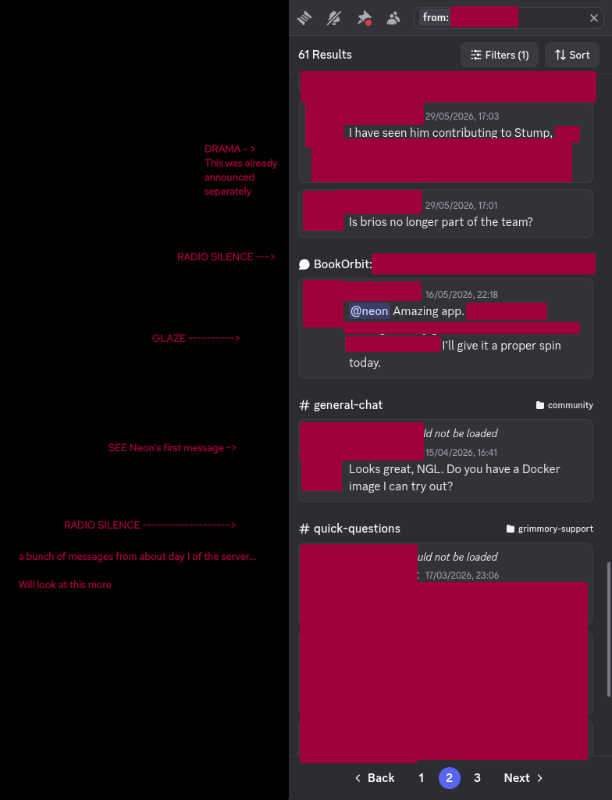</img>

So this guy speaks on day 1, is lowkey doing a little bit of like damage control. But is mostly just acting like a normal person. 
then glaze's Book Orbit after a month of inactivity. And then after another two weeks of inactivity comes into stir drama…


enitrely valid and generic talking point for bookorbit
</img>

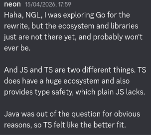</img>
java bad fr
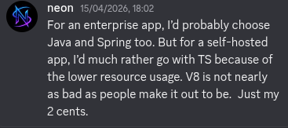</img>

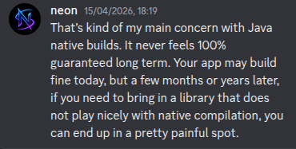</img>

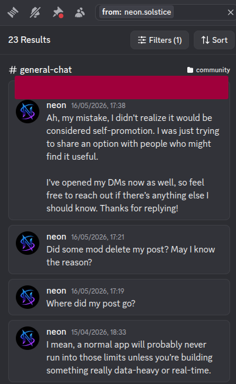</img>

finally. Their last message. Why was my post deleted (advitising bookorbit)
"No spam or self-promotion (server invites, advertisements, etc) without permission from a staff member. This includes DMing fellow members."

And then… poof. Mr. "I wasn't trying to be disrespectful or use your server to promote my project. I posted it here because there's some overlap in users, but I understand why it came across the wrong way." is no where to be seen. 

Unless?

# Spin
(can we take a moment to appreciate poetry)


Let's revise User "Spins" contributions to the discord…
First post: they put this post from acx as their first ever post.

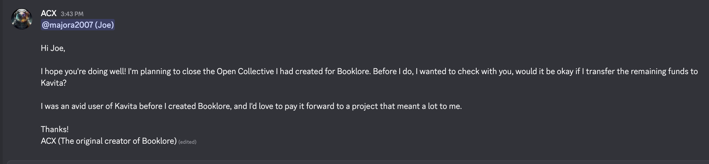</img>

They continue conversations as a "neutral" but definitely lean towards trying to generate sympathy 

</img>

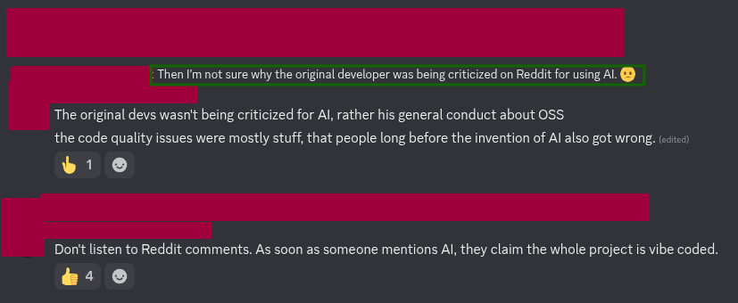</img>


THIS WAS NOT POSTED BY SPIN -- But a fair analysis.

</img>

</img>

Then we're back to where we were before….

- day 1 (as above)
- 1 month later (Glazing Bookorbit with neons posts)
- 2 weeks later Stirring drama regarding a developer leaving the project.

### Going forward Please Keep a Keen Eye to the Dates and how close They Are to Each other~

The Statistics. There was a famous Reddit post now that makes rounds in the community. you are probably familiar. But this was a point of discussion for a while. ofc. as it showed BookOrbit Outclassing Grimmory by some specific figures. Again not really caring to compare a or b.

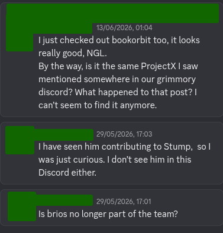</img>

Another almost two weeks later this sleeper agent responds immediately to another user who said. They bring up a good distinction, that initially it was labelled project X. But my opinion that it's very odd to say "oh I just checked it out" after previously saying they would give it a spin when it was PX. Honestly, im pretty sure it was still referenced as book orbit then. And at this point like 2 months had passed.

but let's continue
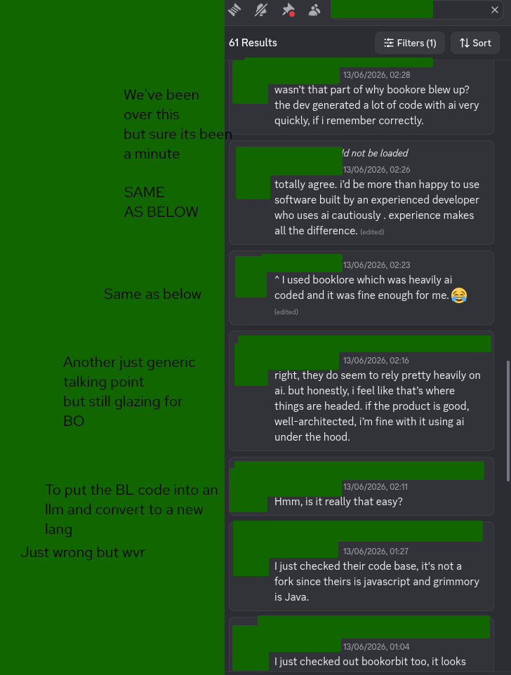</img>

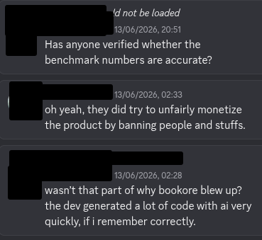</img>

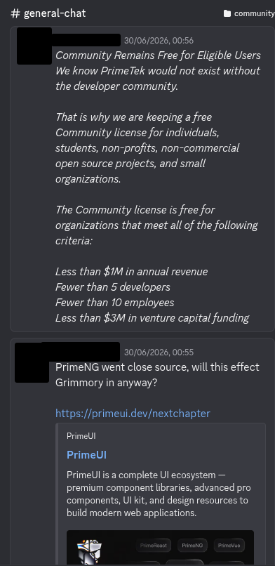</img>

OKAY I Don't really know what to make of this. But Like we're gathering it all I guess so.

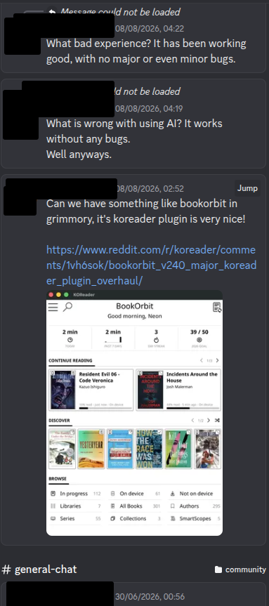</img>

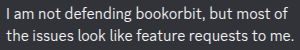</img>
hmmm

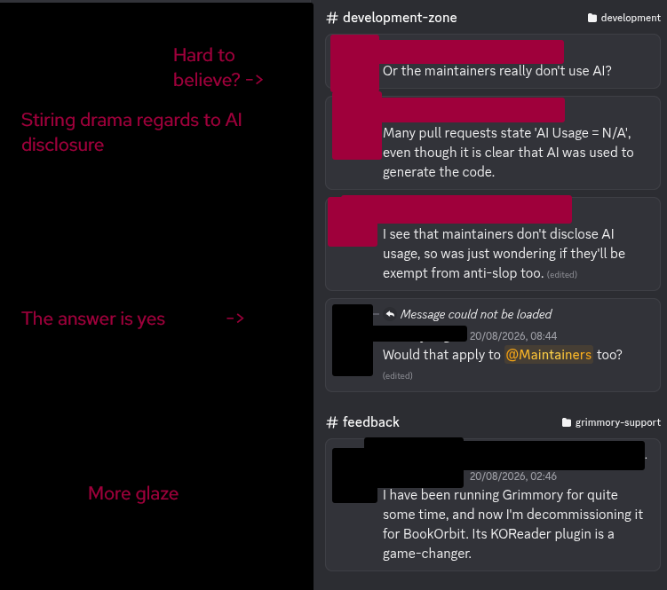</img>

</img>

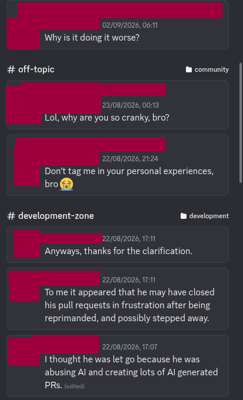</img>


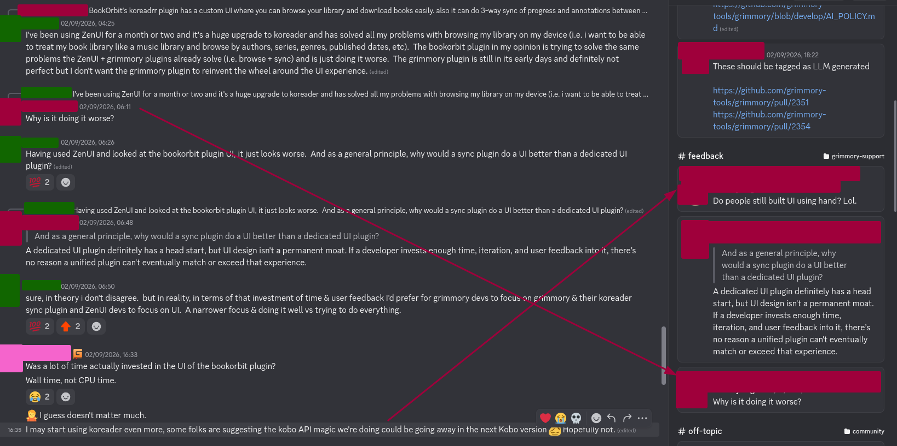</img>

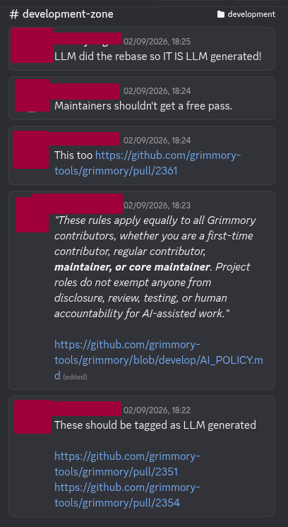</img>

OKAY SO THAT WAS A LOT:

Of 61 messages total across 6 months there is a (non-calculated) distribution of basically 50% shilling Drama and 50% Shilling for BookOrbit. Maybe I'm off the mark here. I don't wanna analyse it too much. However

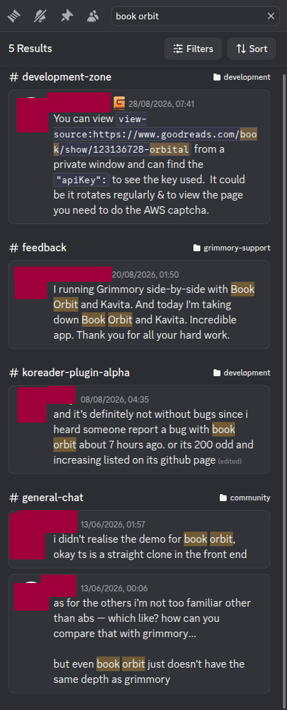</img>

of the above user spin messaged on each of the corresponding days, excluding the first item which is a false use.

Repeating the same for "BookOrbit" shows a similar trend. But It's too much here. Again maybe this is grasping at straws. But I think it's odd at best that someone would be earnestly doing this. And that the former is just a coincidence…

---
# Reddit

Now knowing what we know is true and applying some thought over this conjecture. We have someone who uses AI and likely by extension bots and is very aware of the information circulating about this project. Perhaps even more so within the last 2 weeks as the aforementioned second account was putting a feeler out to make ACX be paranoid. (again not disclosing any evidence at the time) and potentially posting himself as a "generic user" in competitors discords

Well what does that have to say for guerrilla advertising.

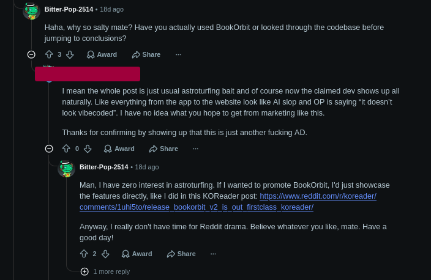</img>

The one account is ACX's Reddit. But the general feeling by many is this same. Not only accounts with questionable status of being bots or not. Hidden history, new accounts, etc.

Also searching for bookorbit across posts finds about 38 in the span of 1 month…

Compare that with grimmory's 26: which includes a number of items about alternative apps people are advertising with grimmory in the back end. Generally comes across as natural or is linked to conversations about bookorbit.

honestly you just have to look for yourself. Here is another point the peak below is around the 18th of august.

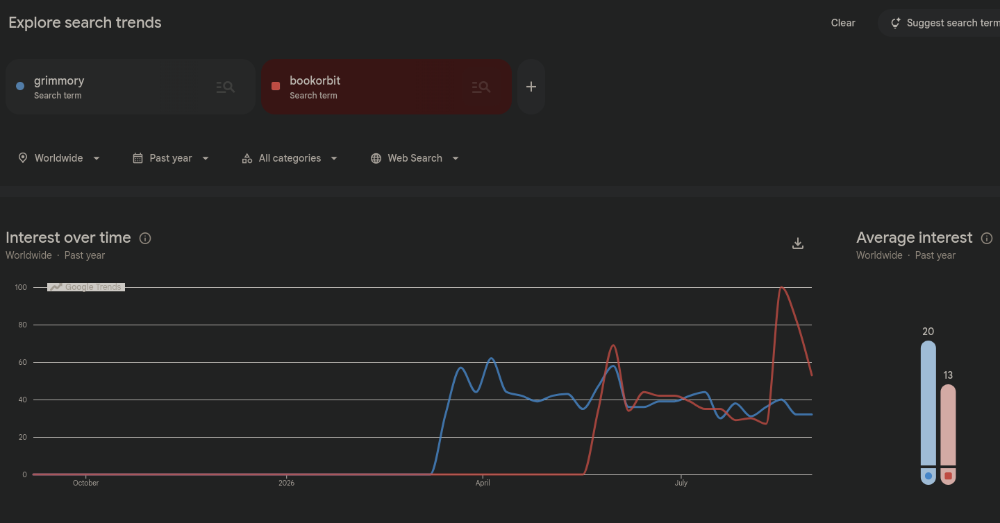</img>

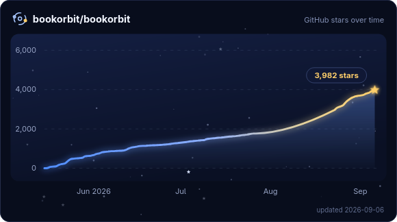</img>

Same time we see it jump by x2. could be natural. But we're just compiling conjecture.

Again I must reiterate, there really isn't going to be a silver bullet in this regard. It is difficult to prove. and we just have to rely on the general feeling. But to me at least combining the general vibe many not just myself have had towards BookOrbit's Marketing. With the Response time it took for ACX to fix the evidence that I leaked regarding the hardcover. "Bots" messaging me with thinly veiled threats of being sued. My original Reddit account being banned by user reporting. The situation regarding user "spin" as well as the general consensus that ACX uses AI to an extreme level. I don't think it's a jump to say that the tactics used to advertise and sell BookOrbit have been disingenuous at best.


# Part 4: Damage Control

(REDACTED PUSH REQUEST)


Now dearest reader let me introduce you to githubs api.
https://api.github.com/repos/bookorbit/bookorbit-site/events

```JSON
[
  {
    "id": "20217745186",
    "type": "PushEvent",
    "actor": {
      "id": 18559658,
      "login": "neonsolstice",
      "display_login": "neonsolstice",
      "gravatar_id": "",
      "url": "https://api.github.com/users/neonsolstice",
      "avatar_url": "https://avatars.githubusercontent.com/u/18559658?"
    },
    "repo": {
      "id": 1215318977,
      "name": "bookorbit/bookorbit-site",
      "url": "https://api.github.com/repos/bookorbit/bookorbit-site"
    },
    "payload": {
      "repository_id": 1215318977,
      "push_id": 42719879996,
      "ref": "refs/heads/main",
      "head": "5f96e318020bc35b18f9e3c735502fb8ff153437",
      "before": "4a1f9a2beceaa8708fa5822851a76efcb674ebef"
    },
    "public": true,
    "created_at": "2026-09-06T06:43:51Z",
    "org": {
      "id": 279911312,
      "login": "bookorbit",
      "gravatar_id": "",
      "url": "https://api.github.com/orgs/bookorbit",
      "avatar_url": "https://avatars.githubusercontent.com/u/279911312?"
    }
  },
  {
    "id": "20215470797",
    "type": "PushEvent",
    "actor": {
      "id": 18559658,
      "login": "neonsolstice",
      "display_login": "neonsolstice",
      "gravatar_id": "",
      "url": "https://api.github.com/users/neonsolstice",
      "avatar_url": "https://avatars.githubusercontent.com/u/18559658?"
    },
    "repo": {
      "id": 1215318977,
      "name": "bookorbit/bookorbit-site",
      "url": "https://api.github.com/repos/bookorbit/bookorbit-site"
    },
    "payload": {
      "repository_id": 1215318977,
      "push_id": 42718197032,
      "ref": "refs/heads/main",
      "head": "0b36ff4128f915ba35e1512f5bfc892ec1e37922",
      "before": "a6ff7ffd9944ecfa9eece81062f23e94a4749e1c"
    },
    "public": true,
    "created_at": "2026-09-06T06:04:54Z",
    "org": {
      "id": 279911312,
      "login": "bookorbit",
      "gravatar_id": "",
      "url": "https://api.github.com/orgs/bookorbit",
      "avatar_url": "https://avatars.githubusercontent.com/u/279911312?"
    }
  },
```
Here are the two push events. Where We can see for a fact that ACX did make those commits. And what I must assume is him subsequently deleting the commit.
All at what time exactly. 6:04 and 6:43. (translate this to 7:04 and 7:43 for my timezone) Once again. I don't remember my day exactly chat but at 7:03 I took a screenshot on my phone looking up the caffeine content of green tea lmao. I think once I got out of bed, and had stopped posting. so going back to the previous claim Where is said I must've posted the comments at about 6:30 to 7:30. here we can see. It's actually much closer to 6:30 -> 7:00. In the timespan of 30 minutes of me posting, this man not only found this comment in a 9 hour old post, went into the code base, Doctored the image, reposted it, and then deleted the commit in attempt to hide the evidence. No prior items exist in the api since the 30th of august than those two and there is a total of

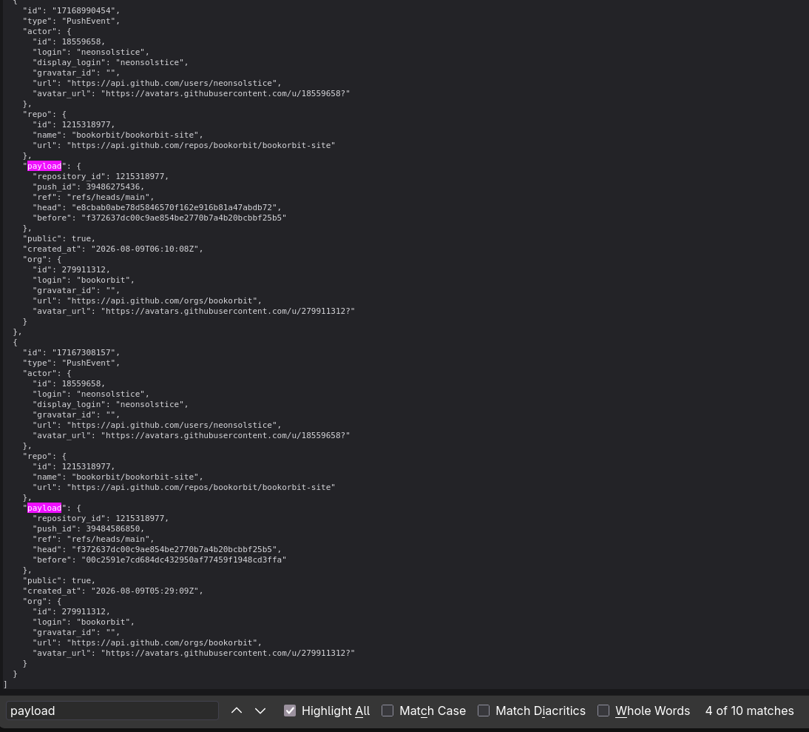</img>

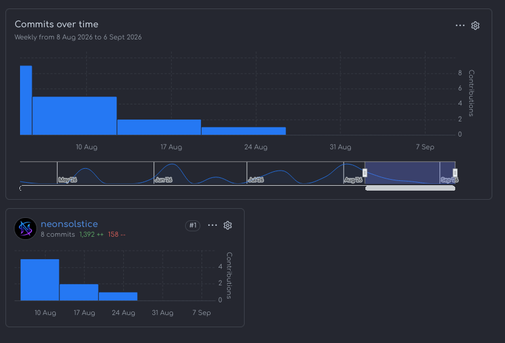</img>

10 payloads: 8 commits + 1 deleted commit + and the act of deleting it.

- [BOOKORBIT LOG](Github-API-Log/repos-bookorbit-20260906.json) : [PasteBin](https://pastebin.com/AfvbzCmu)
- [BOOKORBIT_SITE LOG](Github-API-Log/repos-bookorbit-site-20260906.json): [PasteBin](https://pastebin.com/hKRnsSDe)
- [NEONSOLTICE](Github-API-Log/repos-bookorbit-site-20260906.json): [PasteBin](https://pastebin.com/ApFg8WtN)

oh and one for fun

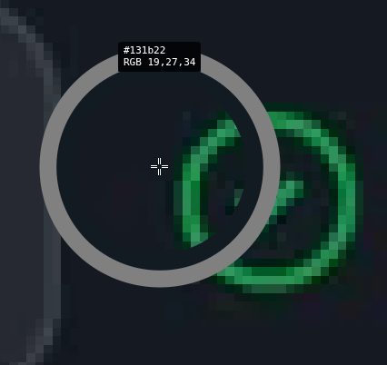</img>

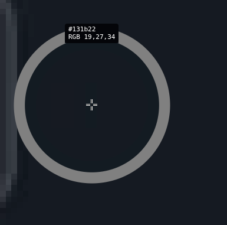</img>

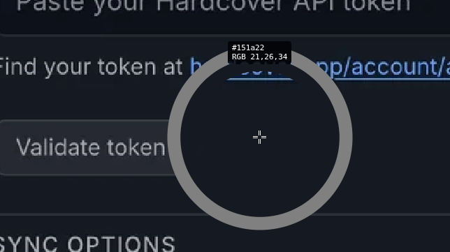</img>

maybe this is just crazy. im not a forensics expert. but that looks like a left over artefact.


# PART 5 : Conclusion

hi guys. Thank you for staying with me here. I wanna just finish up by saying a few things. Firstly is to reiterate I have no vested interest. The only thing I want to do is make sure that people are fully aware that ACX = NS. That is it. What you do with that information is not for me. But I wholeheartedly believe this information *should* be public knowledge, and not something that ACX should be hiding behind. It is very much leaning towards fraud, and if not massively dishonest and misleading for people who not only believed in you but financially supported you. What happened with booklore was shit I get it. It probably felt awful to be you in that moment. But people had genuine criticism, you've mentioned prior that you believed in separating your username NEON from your real life. So I will do you this favour. Every mention of your name, is contained within photos. All the text of this post is anonymized. Anyone searching for you as an individual will not find this post. But they will for NeonSoltice, ACX10, and BookOrbit etc… This is a kindness I did not have to choose. In return I hope you can do the following.

- Apologise and make it abundantly clear moving forward exactly who you are.
- Provide Evidence you made that donation to Katvia.
- Provide an Audit of any donations received from BookLore and BookOrbit, Evidencing how much came in, how much came out and to what exactly.
- Promise Anyone who donated to you will be entitled to a refund.

Of course I can't know the ins and outs of that process. But you chose this path, and people will be holding you to account now. You said

"My plan is to build Project Q properly, support it long term, and build a solid community around it. People can try it if they want and see whether it works for them. If they like it, great. If not, that's totally fine too."

Well you have done parts of this. People seem to have positive things to say about bookorbit. Congratulations. But you lied about your background. And there is a lot of evidence of you doing so across. Reddit. Within this post. Believe me when I say I have all those comments saved too.
So you can have a second chance to make it right, make people believe you can be trusted and are worth believing in.

##

Finally. TLDR:

Evidenced:
- ACX = NS as per documentation exposing their hardcover account and windows user name within output logs
- ACX Doctored one items of this evidence. The only one he was aware of within 30 minutes of a random (my) comment leaking it. (And likely threatened me in doing so under a false account.)
- ACX Deleted the commit where he doctored this evidence.
- ACX mass reported a previous account getting it banned that had less karma.
- ACX tried to advertise bookorbit, then project q in the grimmory discord under said pseudonym

Conjectured:
- ACX uses Bots with the same energy as vibe coding to keep on top of narratives around book orbit. In Discord's / On Reddit.
- ACX uses Bots to utilise guerrilla marketing techniques.
- ACX uses alternative accounts to spread drama, false narratives, and promote bookorbit at any chance possible.

Honestly, I'm probably missing a lot I'm exhausted after all this. There's probably a lot more that can be pointed out and highlighted. But I think my work here is done.
